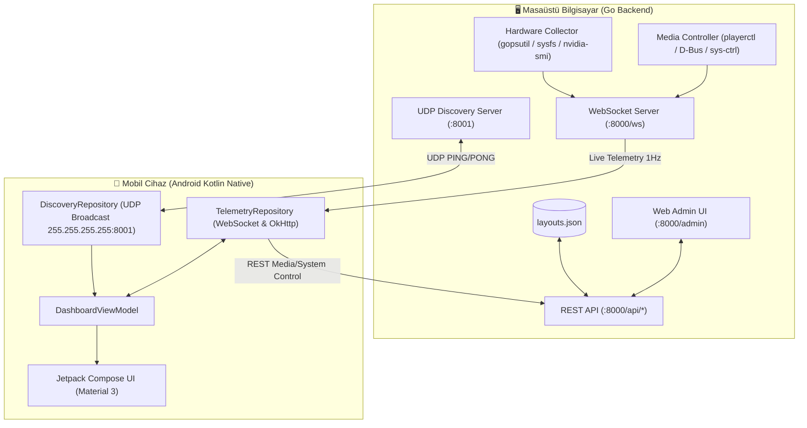

# MobileDashboard - Sistem Mimarisi ve Protokol Standartları (`architecture.md`)

Bu doküman, **MobileDashboard** projesinin Go native backend ve Android Kotlin istemci mimarisini, veri akışını, soket protokollerini ve API uç noktalarını detaylandırır.

---

## 🏗️ 1. Genel Sistem Mimarisi



---

## 📡 2. İletişim Protokolleri

### A. Sıfır Yapılandırmalı UDP Keşif Protokolü (Port 8001)
Mobil uygulamanın bilgisayar IP'sini ezberlemeden veya elle girmeden otomatik bulmasını sağlar:
1. **İstemci (Android):** `255.255.255.255:8001` genel yayın adresine `MOBILEDASHBOARD_DISCOVERY_PING` mesajını fırlatır.
2. **Sunucu (Go):** Gelen paketi yakalar ve istemciye yanıt döner:
   ```text
   MOBILEDASHBOARD_DISCOVERY_PONG|PORT=8000|HOSTNAME=Masaüstü PC|OS=linux
   ```
3. **İstemci (Android):** Yanıt paketinin kaynak IP adresini (`receivePacket.address.hostAddress`) okur ve anında `http://<IP>:8000` adresine bağlanır.

### B. WebSocket Telemetri Akışı (Port 8000 - `/ws`)
Sunucu her 1 saniyede bir (`1Hz`) bağlı olan tüm istemcilere tek bir birleşik JSON telemetri paketi basar:

```json
{
  "timestamp": 1788045600,
  "cpu": {
    "percent": 15.4,
    "temp": 44.0
  },
  "gpu": {
    "name": "NVIDIA GeForce RTX 3050",
    "percent": 24.0,
    "temp": 52.0,
    "memory_used_mb": 1420.0,
    "memory_total_mb": 4096.0
  },
  "ram": {
    "percent": 48.5,
    "used_gb": 7.8,
    "total_gb": 16.0,
    "free_gb": 8.2
  },
  "disk": {
    "percent": 65.0,
    "used_gb": 320.0,
    "total_gb": 500.0,
    "free_gb": 180.0
  },
  "network": {
    "down_kbps": 1250.5,
    "up_kbps": 320.0
  },
  "media": {
    "title": "Starboy",
    "artist": "The Weeknd",
    "album": "Starboy",
    "status": "Playing",
    "art_url": "/api/media/cover?path=%2Ftmp%2Fcover.jpg",
    "position_sec": 45,
    "length_sec": 230
  }
}
```

### C. Düzen Değişikliği Bildirimi (Broadcast)
Kullanıcı web admin panelinden düzenleri kaydettiğinde sunucu bağlı telefonlara WebSocket üzerinden anında güncelleme sinyali gönderir:
```json
{ "type": "LAYOUT_UPDATED" }
```
Android istemci bu mesajı aldığında otomatik olarak `/api/layouts` uç noktasından yeni düzeni çeker ve arayüzü kesintisiz günceller.

---

## 🌐 3. REST API Uç Noktaları

| Metot | Uç Nokta | Açıklama |
|---|---|---|
| `GET` | `/` | Hoş geldiniz / durum yanıtı |
| `GET` | `/admin` | Web tabanlı 2D sürükle-bırak düzen editörü |
| `GET` | `/api/status` | Sunucu durumu, hostname ve versiyon |
| `GET` | `/api/layouts` | Kayıtlı sayfa ve widget düzenlerini listeler |
| `POST` | `/api/layouts` | Düzen listesini `layouts.json` dosyasına yazar |
| `POST` | `/api/media/control` | `{ "action": "play-pause" \| "next" \| "previous" }` |
| `POST` | `/api/system/control`| `{ "action": "vol-up" \| "vol-down" \| "mute" \| "lock" \| "suspend" }` |
| `GET` | `/api/media/cover` | Yerel dosya tabanlı albüm kapağını `image/jpeg` veya `image/png` olarak sunar |
| `WS` | `/ws` | Canlı telemetri akış soketi |

---

## 📱 4. Android İstemci Mimarisi (Jetpack Compose + MVVM)

* **Katmanlı Mimari:**
  * **Data Layer:** `DiscoveryRepository` (UDP soket), `TelemetryRepository` (OkHttp WebSocket & REST çağrıları).
  * **Domain / State Layer:** `DashboardViewModel` (`StateFlow<TelemetryPayload>`, `StateFlow<List<PageLayout>>`, `StateFlow<ConnectionStatus>`).
  * **UI Layer:** `MainActivity` (Window flags, Immersive mode), `DashboardScreen` (HorizontalPager, Dynamic 2D Matrix Layout), `HardwareCards`, `ClockWidgets`, `MediaCard`, `TopOverlayBar`.
* **Kritik Donanım Entegrasyonları:**
  * `FLAG_KEEP_SCREEN_ON`: Ekranın otomatik kapanmasını donanımsal düzeyde engeller.
  * `WindowInsetsControllerCompat`: Çerçevesiz, tam ekran deneyim (`BEHAVIOR_SHOW_TRANSIENT_BARS_BY_SWIPE`).
  * `ScreenBrightness`: Üst panelden doğrudan telefonun ekran ışığını kısma/artırma.
