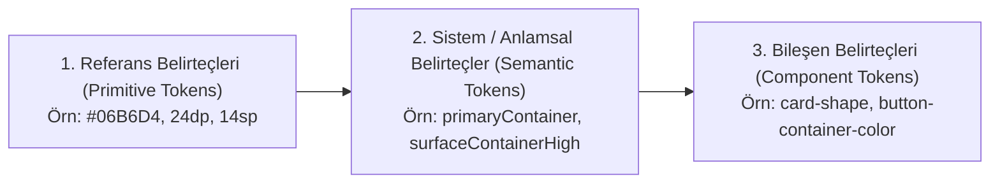

# Material Design 3 (M3 Expressive) - Kapsamlı Tasarım & Token Spesifikasyonu (`material3_spec.md`)

Bu doküman, Google'ın **Material 3 (Material You)** ve **M3 Expressive** tasarım sisteminin temel ilkelerini, token (belirteç) mimarisini, HCT renk uzayını, tonal yüzey hiyerarşisini, tipografi ve şekil ölçeklerini **MobileDashboard** projesi bağlamında teknik ve görsel olarak tanımlar.

---

## 🌟 1. Material 3 & M3 Expressive Nedir?

Material 3 (M3), Google'ın Android 12 ile başlattığı, Android 14 ve 15 ile **M3 Expressive** seviyesine evrilen modern tasarım dilidir.

### Temel Prensipler:
1. **Duygusal ve Canlı (Expressive & Emotional):** Yalnızca nötr ve işlevsel olmak yerine; cesur tipografi, akıcı yay (spring) hareket fiziği ve canlı renk tonlarıyla kullanıcıyla bağ kurar.
2. **Kişiselleştirilebilir & Dinamik (Dynamic Color):** Kullanıcının seçtiği duvar kağıdı veya tema paletinden algoritmik olarak türetilen tonal paletler kullanır.
3. **Gölge Yerine Tonal Derinlik (Tonal Elevation):** Katman ayrımı için yapay gölgeler (`drop-shadow`) yerine, yüzeylerin aydınlık/koyuluk tonları (`Surface Containers`) kullanılır.

---

## 🧬 2. Üç Katmanlı Tasarım Belirteci (Design Token) Mimarisi

Material 3, tasarım kararlarını koddan soyutlayan üç seviyeli bir token yapısına dayanır:



1. **Referans Belirteçleri (Primitive):** Ham renk kodları (`#06B6D4`) veya sayısal değerlerdir (`24dp`). Kullanım amacı belirtmez.
2. **Sistem Belirteçleri (Semantic):** Rengin veya boyutun arayüzdeki amacını belirtir (`primary`, `surfaceContainer`, `outlineVariant`, `errorContainer`).
3. **Bileşen Belirteçleri (Component):** Belirli bir widget veya butona atanan nihai belirteçtir (`M3MediaPillButton-bg = primaryContainer`).

---

## 🎨 3. HCT Renk Uzayı ve Tonal Konteyner Rolleri

Material 3, insan gözünün parlaklık algısına dayanan **HCT (Hue, Chroma, Tone)** renk modelini kullanır. Koyu temada (Dark Theme) ve AMOLED siyahında renk rolleri aşağıdaki gibi dağılır:

### A. Yüzey & Konteyner Rolleri (Dark Mode)

| Rol Adı | Görev ve Anlamı | MobileDashboard Karşılığı |
|---|---|---|
| **`surface` / `background`** | Taban ekran yüzeyi | `AmoledBlack` (`#000000`) |
| **`surfaceDim` / `surfaceContainerLowest`** | En dip arka plan katmanı | `#07070A` |
| **`surfaceContainer`** | Standart kart ve widget gövdesi | `DarkCardBg` (`#0D0E12`) |
| **`surfaceContainerHigh`** | Vurgulu kart içi çipler, pill rozetleri | `M3SurfaceContainerHigh` (`#1E202A`) |
| **`surfaceContainerHighest`** | İlerleme çubuğu kanalları, ikon yuvaları | `M3SurfaceContainerHighest` (`#262835`) |
| **`outline` / `outlineVariant`** | Kart sınır çizgileri (1dp sınır) | `M3OutlineVariant` (`#2D2F3C`) |

### B. Vurgu ve Konteyner Rolleri (Accent Roles)

* **`primary`:** En yüksek öncelikli etkileşim ögesi (Örn: Aktif Oynat/Duraklat butonu, saat iki nokta ayırıcı).
* **`primaryContainer`:** Birincil rengin daha yumuşak, geniş alanlarda göz yormayan tonal versiyonu (Örn: Aktif çip arka planı).
* **`onPrimaryContainer`:** `primaryContainer` üzerine binen metin ve ikonların kontrast rengi.
* **`secondary` / `tertiary`:** İkincil sensörler (GPU, Ağ, SSD) için tamamlayıcı renkler.
* **`error` / `errorContainer`:** Kritik uyarılar ve yüksek sıcaklıklar (`> 80°C` $\rightarrow$ `AccentRed`).

---

## 📐 4. Şekil Ölçeği (Shape Scale) ve Squircle Kuralları

Material 3 Expressive, sert köşeli dikdörtgenler yerine yumuşak, organik ve gözü yormayan şekiller sunar:

| Şekil Seviyesi | Yarıçap (Corner Radius) | Kullanım Alanı |
|---|---|---|
| **None** | `0.dp` | Tam ekran kenarları |
| **Extra Small** | `4.dp` | Mini grafik barları, etiketler |
| **Small** | `8.dp` | Çip köşeleri, mini butonlar |
| **Medium** | `12.dp` | Web editör kartları, diyalog pencereleri |
| **Large** | `16.dp` | İç konteynerler, albüm kapak çerçevesi |
| **Extra Large** | `22.dp - 28.dp` | **Tüm Ana Dashboard Widget Kartları (Squircle)** |
| **Full (Pill)** | `CircleShape` / `%50` | Durum rozetleri, medya dokunmatik butonları |

---

## ✍️ 5. Tipografi Sistemi (Type Scale)

Material 3, 5 temel rol altında 15 seviyeli bir tipografi ölçeği tanımlar:

```text
Display (Large 57sp / Medium 45sp / Small 36sp)  -> Devasa Saatler & Öne Çıkan Rakamlar
Headline (Large 32sp / Medium 28sp / Small 24sp) -> Yüzde (%) Değerleri & Büyük Metrikler
Title (Large 22sp / Medium 16sp / Small 14sp)    -> Kart Başlıkları & Şarkı Adı
Body (Large 16sp / Medium 14sp / Small 12sp)     -> Sanatçı Bilgisi, Canlı İndirme Hızı
Label (Large 14sp / Medium 12sp / Small 11sp)    -> Rozetler, Sıcaklık °C, CPU/GPU Etiketleri
```

---

## 🌊 6. M3 Expressive Hareket & Canlılık (Motion Physics)

M3 Expressive, arayüzü statik bir ekrandan çıkarıp yaşayan bir kontrol paneline dönüştürmek için fizik tabanlı animasyonlar öngörür:

1. **Spring Motion (Yay Fiziği):**
   - İlerleme çubukları ve göstergeler donanım verisi değiştikçe `animateFloatAsState(tween(500))` ile ani zıplamalar olmadan akıcı dolar.
2. **Canlı Ses Ekolayzırı (Waveform Animation):**
   - Şarkı çalarken (`isPlaying == true`) 3-4 farklı frekansta dalgalanan dikey barlar.
3. **Dönen Vinil Modu:**
   - Şarkı çalarken 360 derece kesintisiz dönen vinil plak animasyonu (`infiniteRepeatable`).
4. **Radar & Glow Nabzı (Pulse Glow):**
   - Keşif ekranında ve büyük saatlerde arka planda nefes alan ambient radial glow ışığı.

---

## 💻 7. Jetpack Compose ile Material 3 Entegrasyon Standartları

MobileDashboard uygulamasında M3 bileşenleri oluşturulurken aşağıdaki standart Compose kalıpları esas alınır:

```kotlin
// 1. M3 Surface Tonal Kart
@Composable
fun M3CardContainer(
    modifier: Modifier = Modifier,
    content: @Composable ColumnScope.() -> Unit
) {
    Column(
        modifier = modifier
            .clip(RoundedCornerShape(22.dp))
            .background(DarkCardBg) // M3 Surface Container
            .border(1.dp, M3OutlineVariant, RoundedCornerShape(22.dp))
            .padding(14.dp),
        content = content
    )
}

// 2. M3 Tonal Pill Rozet
@Composable
fun M3StatusPill(text: String, accentColor: Color) {
    Box(
        modifier = Modifier
            .clip(CircleShape)
            .background(M3SurfaceContainerHigh)
            .border(1.dp, M3OutlineVariant, CircleShape)
            .padding(horizontal = 8.dp, vertical = 3.dp)
    ) {
        Text(text, fontSize = 10.sp, fontWeight = FontWeight.Bold, color = accentColor)
    }
}
```

---

## 🔗 Referanslar ve İlgili Belgeler
- [Material 3 & AMOLED Tasarım Sistemi](file:///.agents/rules/design_system.md)
- [Go & Android Sistem Mimarisi](file:///.agents/rules/architecture.md)
- [Geliştirme & Performans Kuralları](file:///.agents/rules/guidelines.md)
